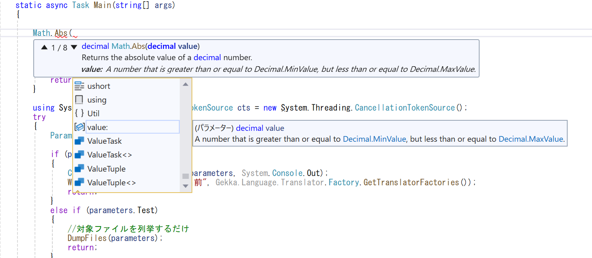
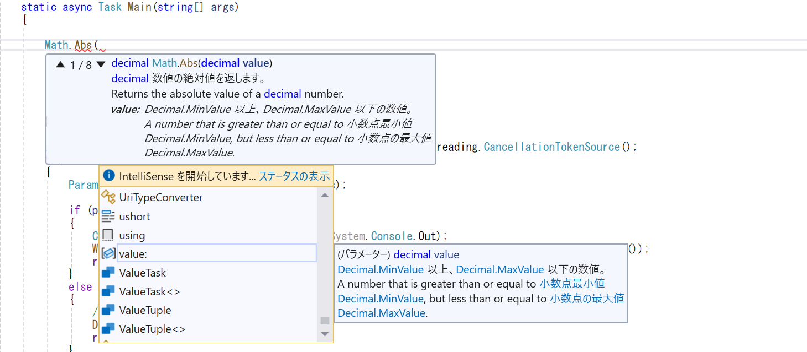

# IntelliSenseXMLTranslator

## 概要
Visual StudioでのIntelliSenseに表示される情報を翻訳して日本語化します  

.Net FrameworkまではMicrosoftが翻訳していましたが、.Net Core以降は翻訳されなくなりました。
あるいは、翻訳されていても機械翻訳の癖があり、非常に読み取りづらい翻訳文になってしまっています。

このプログラムは.Net Core以降やサードパーティの英文を日本語として読み易い文章になるように翻訳します。

## 注意事項
このリポジトリでは基本的には翻訳済みのXMLファイルは配布しません。

- 翻訳対象のライブラリがバージョンアップする毎に,対応するバージョンの翻訳ファイルを生成してはいられません
- .Netの標準ライブラリの翻訳ファイルだけで数十MBになるので、バージョンが増えるたびに容量が増え続けます
- ライブラリの中にはさらにランタイムバージョンごとに細分化されるものがあるので、重複が多くなりすぎます。
- 日本語のみと英語併記のファイルを作ることができるが、両方を配布するのは無駄になります。
- nugetで配布されるがよく使われるサードパーティまで翻訳ファイルを用意するには無理です。
- 
そのため、辞書ファイルの配布をすることで、各自が必要なファイルを生成してください。

## 機能
ローカルにある英語の情報が記述されているXMLファイルを日本語化に翻訳します。

翻訳はこのプロジェクトにある辞書ファイルを参照します。
辞書ファイルにない英文は外部の翻訳機能を呼び出すことで翻訳を行います。

翻訳結果は日本語のみか、英語併記のどちらでも作成できます。
英語併記にすることで翻訳が間違っていても確認しやすくなります。

## 動作

## 翻訳例
- 英語のまま  

- 翻訳(日本語と英語を併記)  
