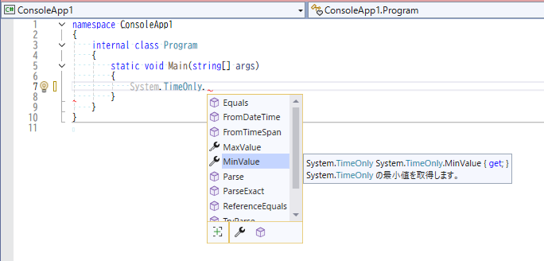
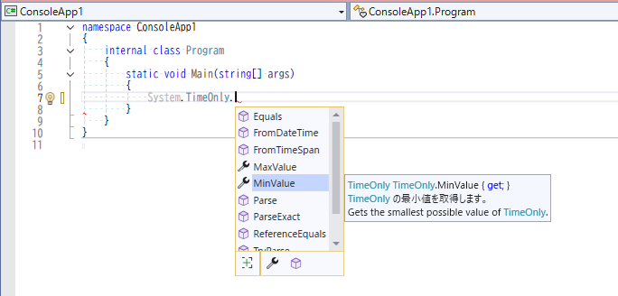
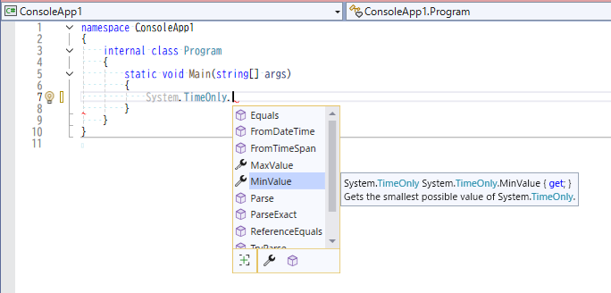
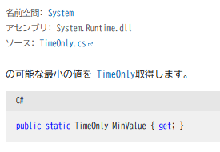

# Visual Studio インテリセンス日本語化計画

## 概要
Visual StudioでのIntelliSenseに表示される情報を翻訳して日本語化します  

.Net FrameworkまではMicrosoftが翻訳していましたが、.Net Core以降は翻訳されなくなりました。  
あるいは、翻訳されていても機械翻訳の癖があり、非常に読み取りづらい翻訳文になってしまっています。


このプログラムは.Net Core以降やサードパーティの英文を日本語として読み易い文章になるように翻訳します。

## 注意事項
このリポジトリでは基本的には翻訳済みのXMLファイルは配布しません。

- 翻訳対象のライブラリがバージョンアップする毎に,対応するバージョンの翻訳ファイルを生成してはいられません
- .Netの標準ライブラリの翻訳ファイルだけで数十MBになるので、バージョンが増えるたびに容量が増え続けます
- ライブラリの中にはさらにランタイムバージョンごとに細分化されるものがあるので、重複が多くなりすぎます。
- 日本語のみと英語併記のファイルを作ることができるが、両方を配布するのは無駄になります。
- nugetで配布されるがよく使われるサードパーティまで翻訳ファイルを用意するには無理です。

そのため、辞書ファイル(Dictionary.ja.dat)の配布をするので、各自が必要なファイルを生成してください。

## 機能
ローカルにある英語の情報が記述されているXMLファイルを日本語化に翻訳します。

翻訳はこのプロジェクトにある辞書ファイルを参照します。
辞書ファイルにない英文は外部の翻訳機能を呼び出すことで翻訳を行います。

翻訳結果は日本語のみか、英語併記のどちらでも作成できます。
英語併記にすることで翻訳が間違っていても確認しやすくなります。

## 翻訳例
- 翻訳(日本語のみ)  


- 翻訳(日本語と英語を併記)  


- 英語のまま  


- 比較としてMicrosoft Learnの翻訳文章例  



## 翻訳の挙動
多くの機械翻訳では、元のXML Document CommentまたはMarkdownで作成してある英文を日本語に翻訳させると、日本語としては読み取れない文章になっています。  
これは文章内の一部がタグで囲まれていると、タグの中身を維持することを優先しているかららしい。流暢な翻訳ができるはずの機械翻訳機であっても破綻してしまいます。(上記のMicrosoft Learnの翻訳例参照)


そのため、タグの箇所をユニークな文字で置換して、タグを含まない文章にしてから翻訳させます。
その後、得られた翻訳結果に含まれる置換文字列を元のタグを復元させることで、比較的まともな日本語に翻訳させています。

## コマンドライン引数

```
コマンドライン引数
  /Dictionary /D @value
    @value

    配布されているDictionary.ja.datあるいは自作の辞書ファイルを指定します

  /DicType /DT @value
    @value
      Switch= Text|Sqlite
      Default=Text

    標準ではテキスト辞書を使用します。
    必要ならSQliteの辞書を作成もできます

    各スイッチの説明

      Text
        元英文と日本語文のペアをテキスト形式で保存します

      Sqlite
        SQliteを辞書ファイルとして元英文をキーとしたテーブルに保存します

  /Translator /T @value
    @value

    後述の翻訳機の名前のいずれかを指定します

  /Browser /B @value
    @value
      Switch= Edge|Chrome
      Default=Chrome

    ブラウザ翻訳させる場合に使用するブラウザ名を指定します

  /Point /P @value
    @value
      Switch= Before|BeforeWithBR|After|AfterWithBR|RemoveOriginal
      Default=BeforeWithBR

    翻訳結果をどのように表示させるかを指定します

    各スイッチの説明

      Before
        元の文字列の前に翻訳文字列を挿入してから改行

      BeforeWithBR
        元の文字列の前に翻訳文字列を挿入してからBRタグを挿入

      After
        元の文字列の後に改行してから翻訳文字列を挿入

      AfterWithBR
        元の文字列の前にBRタグを挿入してから翻訳文字列を挿入

      RemoveOriginal
        元の文字列を翻訳文字列で上書き

  /OutputDir /O @value
    @value

    出力先フォルダを指定します

    出力は元ファイルのフルパスの構造を模倣します。
    ドライブレター以下をそのドライブにコピーすると翻訳ファイルを適用できます。

  /Force /F

    翻訳済みでも上書きするかのフラグ

  /VersionType /Ver @value
    @value
      Switch= All|Latest
      Default=Latest

    最後のバージョンだけにするか

    各スイッチの説明

      All
        検出可能なすべてのバージョンのファイルを翻訳します

      Latest
        検出可能なバージョンのうち、最新と考えられるのみ翻訳します

  /Test

    対象となるファイルの列挙のみ

  /TestXML

    対象となるファイルのXMLが正常であるか確認する

  /SkipFiles /S @value
    @value

    標準では処理不可能としてスキップするリストファイル

    n一部のファイルで不正な構造のXMLのために処理不可能な場合がある。
    そのようなファイルを無視リストアフィルで指定する

  [arguments]
    @value

    入力元のフォルダかファイル(.xml or .list)のパス

    直接XMLファイルを指定するか、リストファイルで指定します

  /Help /?

    ヘルプ

翻訳機の名前
  BrowserTranslator
  DeepL Web
  Dummy
```

